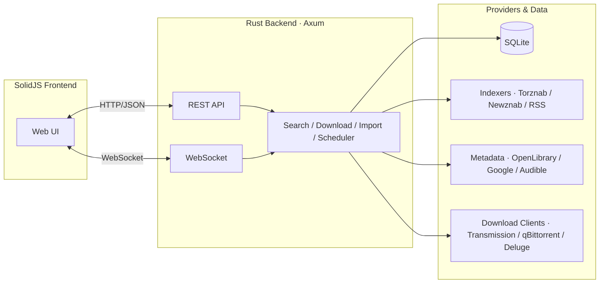

# ReadingRoom

A self-hosted ebook and audiobook management server. Track authors and books, search indexers for downloads, send to download clients, and auto-import into your library.

Built with Rust (Axum + SQLite) and SolidJS 2.0.

> [!WARNING]
> This is for my own personal use and is **SLOP**
>
> Use your own discretion if you want
>
> `¯\(ツ)/¯`

## Install

<details>
<summary><b>Nix</b></summary>

Run the combined package (backend + built frontend) directly from the flake:

```bash
nix run github:Sleeping-Donut/readingroom -- --data-dir /var/lib/readingroom
```

Or build the individual packages:

| Package | Contents |
|---------|----------|
| `readingroom` (default) | Backend binary + built frontend, combined |
| `readingroom-server` | Rust backend binary only |
| `readingroom-web` | Built frontend static assets |

```bash
nix build github:Sleeping-Donut/readingroom#server
nix build github:Sleeping-Donut/readingroom#web
nix build github:Sleeping-Donut/readingroom
```

The backend auto-detects the frontend assets via the `FRONTEND_DIST` env var (set by the combined package).
</details>

<details>
<summary><b>NixOS</b></summary>

Add the flake as an input and import the module (the service defaults to the flake's combined package):

```nix
{
  inputs = {
    nixpkgs.url = "github:NixOS/nixpkgs/nixos-unstable";
    readingroom.url = "github:Sleeping-Donut/readingroom";
  };

  outputs = { self, nixpkgs, readingroom, ... }:
    let
      system = "x86_64-linux";
    in
    {
      nixosConfigurations.myHost = nixpkgs.lib.nixosSystem {
        inherit system;
        modules = [
          readingroom.nixosModules.default
          {
            services.readingroom = {
              enable = true;
              port = 5299;
              dataDir = "/var/lib/readingroom";
              auth.enable = true;
              openFirewall = true;
            };
          }
        ];
      };
    };
}
```
</details>

<details>
<summary><b>Docker</b></summary>

Builds the combined package with a NixOS base and runs it from a scratch layer (no distro overhead). Docker builds straight from the repo — no clone needed:

```bash
docker build -t readingroom https://github.com/Sleeping-Donut/readingroom
docker run -d \
  -p 5299:5299 \
  -v readingroom-data:/data \
  readingroom
```

The image builds the combined package with Nix and runs it from a scratch layer (only the runtime closure is copied, so there's no distro or Nix overhead). Mount a volume at `/data` for the database and config.
</details>

## Basic Usage

### 1. Configure an Indexer

Go to **Settings → Indexers** and add a Torznab or Newznab indexer (e.g., Jackett/Prowlarr). Provide the URL and API key.

### 2. Configure a Download Client

Go to **Settings → Download Clients** and add Transmission, qBittorrent, or Deluge. Click **Test** to verify connectivity.

### 3. Add an Author

Go to **Authors** → **Add Author**, search by name, and select from metadata results. The author and their books will be tracked.

### 4. Search for Books

Open an author's detail page and click **Search Indexers** to find releases. Click **Download** on a release to send it to your download client.

### 5. Automatic Import

When a download completes, ReadingRoom automatically imports the files into your library. Monitor progress on the **Queue** page.

### 6. Notifications (Optional)

Go to **Settings → Notifications** and add an Apprise webhook URL to receive grab/import notifications.

## Configuration

All configuration is in a TOML file at `{data_dir}/config.toml`. Key sections:

```toml
[server]
host = "127.0.0.1"
port = 5299
library_root = "/path/to/books"     # Where imported files go

[auth]
enabled = true                       # Enable JWT auth

[library]
rename_files = true
book_file_format = "{book_title}.{ext}"
author_folder_format = "{book_title}"
```

### Rename Pattern Placeholders

| Placeholder | Description |
|-------------|-------------|
| `{book_id}` | Database book ID |
| `{book_title}` | Book title (sanitized) |
| `{quality}` | Quality variant (EPUB, MP3, etc.) |
| `{format}` | File format (epub, mp3, etc.) |
| `{ext}` | File extension |

## Features

- **Author & Book Management** — Search, add, monitor authors and books via OpenLibrary or Google Books
- **Metadata Sources** — OpenLibrary (default, no key), Google Books (API key), Audible via audnex.us
- **Indexers** — Torznab, Newznab, RSS/Atom (compatible with Jackett/Prowlarr)
- **Download Clients** — Transmission, qBittorrent, Deluge
- **Import Pipeline** — Automatic scan, classify, rename, and import on download completion; ZIP extraction
- **OPF Metadata** — Sidecar metadata files written alongside imported ebooks
- **Bulk Import** — Import existing ebook/audio collections from disk
- **Calibre Import** — Import books from an existing Calibre library
- **Format Conversion** — Convert between ebook formats via `ebook-convert` (calibre) or audio via `ffmpeg`
- **CSV Import Lists** — Import from GoodReads CSV exports
- **Scheduler** — Automatic missing book search, download polling
- **WebSocket** — Real-time queue updates
- **Auth** — Optional JWT-based authentication
- **Backup/Restore** — Timestamped ZIP backups of the database
- **Health Checks** — System health endpoint with per-component status

## Architecture



## Development

### Nix

From a checkout, enter the dev shell — all tools (Rust, Node, pnpm, Vite+ CLI, sqlx-cli) are provided by Nix:

```bash
nix develop
```

Run the pieces:

```bash
# Terminal 1: backend (http://127.0.0.1:5299)
cargo run -- --data-dir ./localdump/datadir

# Terminal 2: frontend dev server (http://127.0.0.1:5173, proxies /api to the backend)
cd frontend && vp dev
```

Build the whole thing (backend + frontend assembled into `dist/`) with one command:

```bash
just release          # assemble into dist/ (readingroom-server + web/)
just run-release      # run the assembled result
```

### Arch / from source

Install the build dependencies (as declared in `flake.nix` / `nix/package.nix`):

- **Rust toolchain** — `rust` (or `rustup`)
- **Node.js** — `nodejs`
- **pnpm** — `pnpm`
- **Vite+ CLI (`vp`)** — install via the official installer `curl -fsSL https://vite.plus | bash` (no package in the official repos)
- **sqlx-cli** (for `sqlx migrate run`) — `sqlx-cli-bin` from the AUR

Optional dev helpers: `cargo-watch`, `cargo-audit`, `cargo-edit`, `cargo-expand`, `cargo-insta`, `just`, `typos`, and `cargo-nextest` (AUR) for tests. `docker` is only needed if you want to test against containerized download clients.

Then build both the server and web:

```bash
cargo build
cd frontend && vp install && vp build
```
